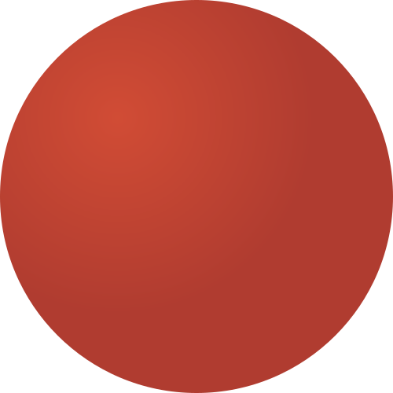

# OutSystems-Icon-Ex

Icons for developing with OutSystems that I made for myself.

 ServerAction icon
 ServerActionAction icon (Private)
 ServerActionAction icon (Cached)
 ServerActionAction icon (User exception is containing)
 ServerActionAction icon (Private)(User exception is containing)
 ServerActionAction icon (Cached)(User exception is containing)
